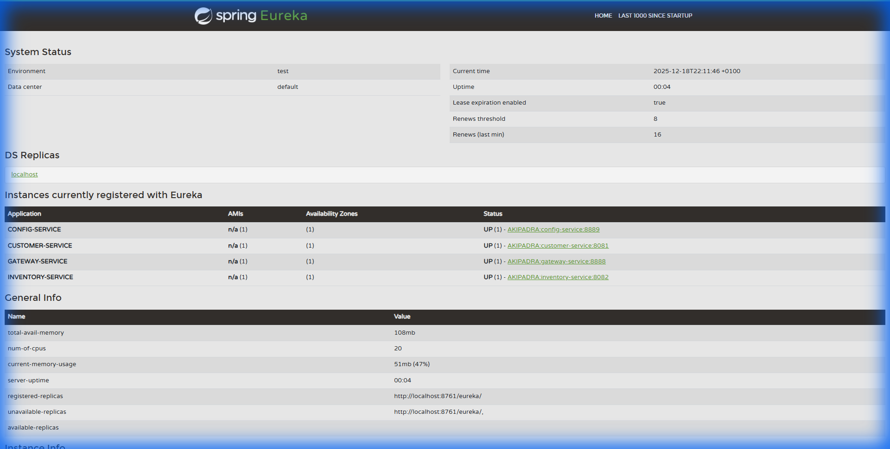
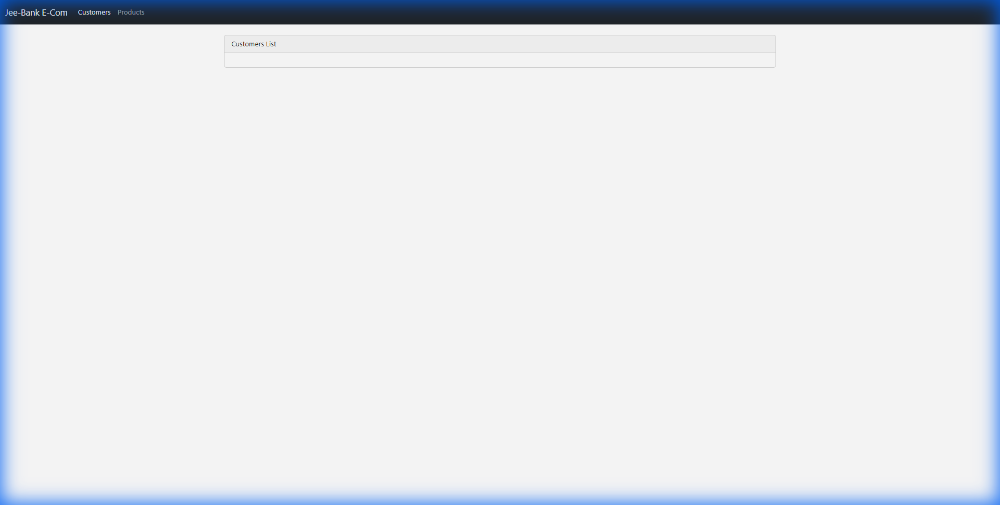
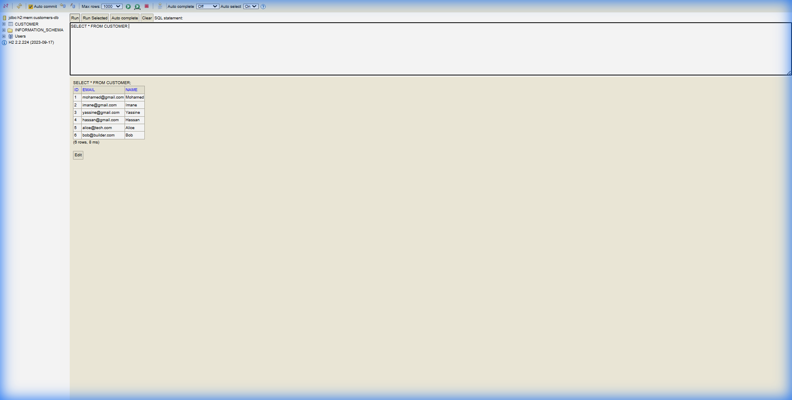

# Classwork 7: Full Integration - JEE Bank Microservices

## Complete Microservices Application

This project combines all activities into a complete microservices-based banking application.

## Architecture Overview
```
┌──────────────────────────────────────────────────────────────┐
│                      Angular Frontend                         │
│                        Port: 4200                             │
└──────────────────────────────┬───────────────────────────────┘
                               │
┌──────────────────────────────▼───────────────────────────────┐
│                      API Gateway                              │
│                       Port: 8888                              │
└──────────────────────────────┬───────────────────────────────┘
                               │
┌──────────────────────────────▼───────────────────────────────┐
│                    Discovery Service                          │
│                      (Eureka) 8761                            │
└──────────────────────────────┬───────────────────────────────┘
                               │
    ┌──────────────┬───────────┼───────────┬──────────────┐
    │              │           │           │              │
┌───▼───┐    ┌─────▼─────┐ ┌───▼───┐  ┌────▼────┐   ┌─────▼─────┐
│Customer│    │ Inventory │ │Billing│  │ Chatbot │   │  Config   │
│ :8081  │    │   :8082   │ │ :8083 │  │  :8084  │   │   :8889   │
└────────┘    └───────────┘ └───────┘  └─────────┘   └───────────┘
```

## Services Included
| Service | Port | Description |
|---------|------|-------------|
| discovery-service | 8761 | Eureka Service Registry |
| config-service | 8889 | Centralized Config |
| gateway-service | 8888 | Spring Cloud Gateway |
| customer-service | 8081 | Customer CRUD + GraphQL |
| inventory-service | 8082 | Product Management |
| billing-service | 8083 | Order Processing with Feign |
| chatbot-service | 8084 | AI Chatbot (Spring AI) |
| angular-client | 4200 | Angular Frontend |

## Quick Start
```powershell
# Run all services
.\run-all-services.ps1
```

Or start individually in order:
1. discovery-service
2. config-service
3. gateway-service
4. Other services (customer, inventory, billing, chatbot)
5. angular-client

## Docker Support
```bash
docker-compose up -d
```

## Technologies
- Spring Boot 3.2+
- Spring Cloud 2023.0
- Angular 17+
- Spring AI (OpenAI)
- H2 / PostgreSQL
- Eureka, Feign, Gateway

## Author
Youssef Atertour - EMSI 2025

---

## Proof Screenshots

### Microservices Architecture
**Eureka Dashboard**


**Gateway Routing**


### Frontend
**Angular UI**


### Security
**Keycloak Login**


### Backend Services
**Customer Service H2 Console**


**Customer REST API**


